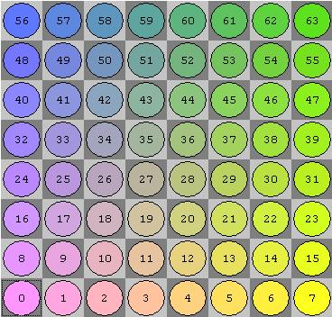

<TOCInline toc={props.toc} asDisclosure />


I had the honor of [speaking at Systems Distributed](https://www.youtube.com/watch?v=whqMdAD5JTc) at the end of June.
Since it was hosted by TigerBeetle who is one of the largest zig users, a lot of the zig community was there.
After talking to some of them, Zig seemed more interesting for me to try out.

Around the same time my youtube algorithm got me hooked on chess content.
I'm not a good chess player by any means, but it started giving me the urge to make my own chess engine.
If I make a good chess engine that should obviously make me a better chess player...

So I decided to merge the two desires together and make my own engine in zig.

This post will be part describing how a chess engine works and part my thoughts on using zig to make it.
This won't really be a tutorial, more of a vibe, but hopefully you learn something!

If your lazy and just wanna read some code it lives [here](https://github.com/JRMurr/ZigFish)
I called it ZigFish since this will obviously match Stockfish in elo....

# Try it out

If you're on a browser, you should see the engine below... (if not please go easy on me, wasm has caused me so much pain....).
Play it and see how you do! If you give it more time to think (the slider) it will play better but its still just ok.
I hope to add more improvements over time

<Chess/>


# How Does a Chess Engine Work?

At its core a chess engine needs to do 3 things
- Know all the rules of chess
- Quickly explore the space of all moves
- Evaluate a position to figure out what moves are good/bad

It needs to do all of those things FAST, chess generally has a move time limit so you don't have infinite time to figure out what move to play.


So the first thing I did was implement all of the chess rules so the engine would be a good boi and play only legal moves.
We can't have it play like [chatgpt where a rook can fly diagonally across the board...](https://youtu.be/rSCNW1OCk_M?si=zjoIu-h-njEsIiYF&t=591)


## A Gui

Before I even started the logic I wanted to have a nice gui to play with, so I found this [zig raylib binding](https://github.com/Not-Nik/raylib-zig).

This was my first interaction with Zig's build system/package management. To add this dependency you can run
```shell
  zig fetch --save https://github.com/Not-Nik/raylib-zig/archive/{commit-sha}.tar.gz
```

This will add the tar ball with its hash to `build.zig.zon` with something like
```zig
 .dependencies = .{
        .@"raylib-zig" = .{
            .url = "https://github.com/Not-Nik/raylib-zig/archive/2d8e856009bf0ee60ef78bde78e32512bdaae714.tar.gz",
            .hash = "1220d32c92222ded6912529bbd502b2e0c5c5c2056c4b709ad0f6924d6524343a2d2",
        },
        // <other deps>
 }
```
So a normal lock format but doesn't rely on any centralized package repo like npm or cargo.

Then you need to tell zig to link in the dep, since raylib is a C dep, zig can actually compile it for you

The `build.zig` file makes a dag for all the different build steps and artifacts. So I can add

```zig
const raylib_dep = b.dependency("raylib-zig", .{
    .target = target,
    .optimize = optimize,
});

const raylib = raylib_dep.module("raylib"); // main raylib module
const raygui = raylib_dep.module("raygui"); // raygui module
const raylib_artifact = raylib_dep.artifact("raylib"); // raylib C library


// the gui executable
const exe = b.addExecutable(.{
    .name = "zigfish-gui",
    .root_source_file = b.path("src/main.zig"),
    .target = target,
    .optimize = optimize,
});

exe.linkLibrary(raylib_artifact);
exe.root_module.addImport("raylib", raylib);
exe.root_module.addImport("raygui", raygui);
```

Its easy to make the `build.zig` "script" a pile of spaghetti like any build system but at least since its all just zig code you can make it have nice abstractions.
I chose the spaghetti route since I'm not smart enough yet to make it nice but it still "just works"

I'll leave out the tedium but overall the process of getting some chess pieces drawn on the board, and some logic to move them around was pretty straightforward.
If your curious feel free to checkout [the ui code here](https://github.com/JRMurr/ZigFish/tree/main/src/ui).
Raylib is super nice to use, the simple things are simple. Since chess is just draw some rectangles and a few sprites, it didn't take long to have the board display good to go.

## The logic

So now that I have a chess board to draw, I need to implement all the rules of chess.
This is where the [Chess Programming Wiki](https://www.chessprogramming.org/Main_Page) became my best friend.
It has sooooooo many resources to help make your engine.

### Board Representation

The first main decision is how do you [represent the board](https://www.chessprogramming.org/Board_Representation).

The first approach I took was to make a struct like this
```zig
// NOTE: don't need to manually list the values for each enum tag
// I just like doing it...
pub const Color = enum(u1) {
    White = 0,
    Black = 1,
};

pub const Kind = enum(u3) {
    King = 0,
    Queen = 1,
    Bishop = 2,
    Knight = 3,
    Rook = 4,
    Pawn = 5,
};

pub const Piece = struct packed {
    color: Color,
    kind: Kind,
}
```

This represents a chess Piece as a color + its type/kind.

Then you could so something like

```zig
pub const Board = struct {
    squares: [64]?Piece
}
```

So the board is an array of 64 squares (8x8 board). The `?` means the elements of the array are null or a Piece.
Optional types in zig are great! Its just like the `Option` type in rust but more directly built into the language.


This array approach works and I used it for a while but has some downsides.
- You need to loop over the whole array a lot to find all the pieces you care about
- Sliding pieces like rooks, bishops, and queens require you to "walk" each direction which takes time (this will matter a lot during move generation)
- Its not the cool option I'll explain in a second


#### Bit Boards

So after a little while using this array representation I switched to a [BitBoard](https://www.chessprogramming.org/Bitboards)

The core idea is, since there are 64 squares, you can use a `u64` where each bit represents 1 square. If the `nth` bit is set, a piece is is on the `nth` square.
You then have 6 `u64`s to track each piece type, and 2 more to track the color of those pieces. In my case I had a redundant 9th `u64` just for all occupied squares.

So if I want to know where all the white pawns are, I can do a bitwise intersection of the pawn bitset and the white bitset.

The other benefit is when you apply shifts/masks on the bitset, it will apply to all pieces at once.
For example to figure out all possible squares knights can move to you can do this

```zig
pub fn knightMoves(self: Self) Self {
    // https://www.chessprogramming.org/Knight_Pattern#Multiple_Knight_Attacks
    const mask = self.bit_set.mask;

    const l1 = (mask >> 1) & NOT_FILE_H;
    const l2 = (mask >> 2) & NOT_FILE_GH;
    const r1 = (mask << 1) & NOT_FILE_A;
    const r2 = (mask << 2) & NOT_FILE_AB;
    const h1 = l1 | r1;
    const h2 = l2 | r2;
    return Self.fromMask((h1 << 16) | (h1 >> 16) | (h2 << 8) | (h2 >> 8));
}
```
So a few bitwise operations handle all knights at the same time.
This speed is invaluable when figuring out all the squares the enemy pieces attack.

Zig has a nice helper in the std lib [std.bit_set.IntegerBitSet](https://ziglang.org/documentation/master/std/#std.bit_set.IntegerBitSet).
This just wraps a unsigned int and has some nice helpers for set union, intersection, and iterating over the set bits.

I wrapped it in my own struct
```zig
pub const BoardBitSet = packed struct {
    const Self = @This();

    bit_set: BitSet,

    // a bunch of funcs...
}
```

So now my `Board` struct looks like

```zig
// Some compile time magic to get the number of tags in an enum
inline fn enumLen(comptime T: type) comptime_int {
    return @typeInfo(T).Enum.fields.len;
}
const NUM_KINDS = enumLen(Kind);
const NUM_COLOR = enumLen(Color);

pub const Board = struct {
    const Self = @This();
    kind_sets: [NUM_KINDS]BoardBitSet,
    color_sets: [NUM_COLOR]BoardBitSet,
    /// redundant set for easy check if a square is occupied
    occupied_set: BoardBitSet,

    active_color: Color = Color.White,


    pub fn getPieceSet(self: *const Self, p: Piece) BoardBitSet {
        const color = self.color_sets[@intFromEnum(p.color)];
        const kind = self.kind_sets[@intFromEnum(p.kind)];

        return color.intersectWith(kind);
    }
}
```

This is where I really started to love zig's comptime.
My `enumLen` helper can introspect the enum type I pass in to get how many possible enum tags there are.
I can then make an array of that size, then use `@intFromEnum` to lookup the index for each tag type in that array.

### Move Generation

Now that we have a board, we can start figuring out the moves.
While each piece's movement rules are pretty simple to humans, there are SO MANY EDGE CASES.


Things like
- En Passant
- Castling
- Pinned Pieces (a piece who is blocking an attack on the king)

Those situations on their own are not horrible, what really caused pain was combos of those situations. 
I'd estimate roughly 60-70% of the bugs I ran into on this project were logic issues involving the edge cases mentioned above.

#### Sliding Moves

The sliding pieces can eat up a lot of time. The queen can "see" up to 27 squares if its at the center of the board.
So if you have a naive algorithm that "walks" the 8 directions you can go that can eat up a lot of the move generation time.

So this is where BitBoards can help a lot. I went with what the chess wiki calls the ["Classical Approach"](https://www.chessprogramming.org/Classical_Approach).

At its core, I precompute the 8 rays on each square. A ray is all the potential squares a piece could slide to along a column, row, or diagonal in both directions.

So for example here are some of the rays for the b4 square (stolen from the chess wiki)
```
East (+1)           North (+8)           NorthEast (+9)      NorthWest (+7)
. . . . . . . .     . . . 1 . . . .      . . . . . . . 1     . . . . . . . .
. . . . . . . .     . . . 1 . . . .      . . . . . . 1 .     1 . . . . . . .
. . . . . . . .     . . . 1 . . . .      . . . . . 1 . .     . 1 . . . . . .
. . . . . . . .     . . . 1 . . . .      . . . . 1 . . .     . . 1 . . . . .
. . . R 1 1 1 1     . . . R . . . .      . . . B . . . .     . . . B . . . .
. . . . . . . .     . . . . . . . .      . . . . . . . .     . . . . . . . .
. . . . . . . .     . . . . . . . .      . . . . . . . .     . . . . . . . .
. . . . . . . .     . . . . . . . .      . . . . . . . .     . . . . . . . .
```

Now I can use the ray as a mask to see any potential blockers along the ray.

So for example
```
occupied         &  NorthWest(g2)       {a8, c6}
1 . 1 1 1 1 1 1     1 . . . . . . .     1 . . . . . . .
1 . 1 1 1 1 1 1     . 1 . . . . . .     . . . . . . . .
. 1 1 . . . . .     . . 1 . . . . .     . . 1 . . . . .
. . . . . . . .     . . . 1 . . . .     . . . . . . . .
. . . . . . . .  &  . . . . 1 . . .  =  . . . . . . . .
. . . . . . 1 .     . . . . . 1 . .     . . . . . . . .
1 1 1 1 1 1 B 1     . . . . . . . .     . . . . . . . .
1 1 1 1 1 . 1 1     . . . . . . . .     . . . . . . . .
```

Once the ray mask is applied to the occupied board shown here only 2 squares remain (a8 and c6).

##### Bit scans

The bit board uses [Little Endian Rank File Mapping](https://www.chessprogramming.org/Square_Mapping_Considerations#LittleEndianRankFileMapping).
This basically means lower Ranks (rows) have lower index and then each rank starts with the a file as the lowest index in that rank.

Here are how the indexes are laid out (the indexes here correspond the `nth` bit in the `u64` backing the bit board)




So when if you look at the `u64` backing the bitboard, "lower" bits are near the bottom of the board. More concretely the least significant bit would be a1. The most significant bit would be h8.

##### Back to sliding...

So back to the ray example. We have a NorthWest ray that intersected with two occupied squares.

```
{a8, c6}
1 . . . . . . .
. . . . . . . .
. . 1 . . . . .
. . . . . . . .
. . . . . . . .
. . . . . . . .
. . . . . . . .
. . . . . . . .
```

Since we want the first hit along this ray, we want the least significant bit, which in this case would be c6.

So any square "behind" c6 will not be accessible for this piece.
We can use the same NorthWest ray on c6 and "subtract" its ray from the ray original ray we computed on g2

```
NorthWest(c6)   xor  NorthWest(g2)   =  final northWest Attacks
1 . . . . . . .      1 . . . . . . .    . . . . . . . . 
. 1 . . . . . .      . 1 . . . . . .    . . . . . . . . 
. . . . . . . .      . . 1 . . . . .    . . 1 . . . . . 
. . . . . . . .      . . . 1 . . . .    . . . 1 . . . . 
. . . . . . . .      . . . . 1 . . .    . . . . 1 . . . 
. . . . . . . .      . . . . . 1 . .    . . . . . 1 . . 
. . . . . . . .      . . . . . . . .    . . . . . . . . 
. . . . . . . .      . . . . . . . .    . . . . . . . . 
```

So with an intersection, a bit scan, and an xor I have all the possible squares a piece could slide to along that ray!

##### Zig Comptime

These rays could be computed as needed, they aren't horribly expensive but are not free.
It would be great to store all rays ahead of time.
Thankfully zig's comptime logic is great. You can have any pure zig code run at compile time and output whatever you want!
So I compute all rays at compile time, the rays are just statically stored in the produced executable.

I compute the rays by first computing all the "lines" for each square. A Line is just both directions of a ray combined

```zig
pub const BitSet = std.bit_set.IntegerBitSet(64);
pub const MaskInt = BitSet.MaskInt;
pub const ShiftInt = BitSet.ShiftInt;

// mask for the bottom rank (row)
pub const RANK_0: MaskInt = 0x00000000000000FF;

// https://www.chessprogramming.org/On_an_empty_Board#By_Calculation_3
// given a square index, get all squares on its rank (row)
pub fn rankMask(sq: u32) MaskInt {
    return RANK_0 << toShiftInt(sq & 56);
}

// mask for the A file (left most column)
pub const FILE_A: MaskInt = 0x0101010101010101;

// get all squares on the same file (column) as the square passed in
pub fn fileMask(sq: u32) MaskInt {
    return FILE_A << toShiftInt(sq & 7);
}


pub const MAIN_DIAG: MaskInt = 0x8040201008040201; // A1 to H8
pub const ANTI_DIAG: MaskInt = 0x0102040810204080; // H1 to A8

// get all squares on the South west to North east diagonal this square is on
inline fn mainDiagonalMask(sq: u32) MaskInt {
    const sq_i32 = @as(i32, @intCast(sq));

    const diag: i32 = (sq_i32 & 7) - (sq_i32 >> 3);
    return if (diag >= 0)
        MAIN_DIAG >> (toShiftInt(diag) * 8)
    else
        MAIN_DIAG << (toShiftInt(-diag) * 8);
}

// get all squares on the North west to South east diagonal this square is on
inline fn antiDiagonalMask(sq: u32) MaskInt {
    const sq_i32 = @as(i32, @intCast(sq));
    const diag: i32 = 7 - (sq_i32 & 7) - (sq_i32 >> 3);
    return if (diag >= 0)
        ANTI_DIAG >> (toShiftInt(diag) * 8)
    else
        ANTI_DIAG << (toShiftInt(-diag) * 8);
}

pub const Line = enum {
    Rank,
    File,
    MainDiag,
    AntiDiag,

    // sq is the "index" of the square on the board, so a1 is 0, b1 is 1, etc
    pub fn computeLine(self: Line, sq: u32) BoardBitSet {

        const mask = switch (self) {
            .Rank => rankMask(sq),
            .File => fileMask(sq),
            .MainDiag => mainDiagonalMask(sq),
            .AntiDiag => antiDiagonalMask(sq),
        };

        return BoardBitSet.fromMask(mask);
    }
};
```

With this setup, I can stores all lines for each square in an array thats computed at compile time

```zig
pub const Lines = [64][NUM_LINES]BoardBitSet;

pub fn computeLines() Lines {
    // not exact but tells zig its ok to do more work at comptime
    // by default zig will error if it does more than 1k branches at comptime to avoid possible infinite loops
    @setEvalBranchQuota(64 * NUM_LINES * 100); 
    var moves: [64][NUM_LINES]BoardBitSet = undefined;

    inline for (0..64) |idx| {
        inline for (utils.enumFields(Line)) |f| {
            const line_idx = f.value;
            const line: Line = @enumFromInt(line_idx);

            moves[idx][line_idx] = line.computeLine(idx);
        }
    }
    return moves;
}

pub const LINES = computeLines(); // this is a top level variable so it just runs at compile time
```

I then can "split" the lines in half to get the corresponding rays

```zig
pub const Dir = enum(u3) {
    North = 0,
    South = 1,
    West = 2,
    East = 3,
    NorthWest = 4,
    NorthEast = 5,
    SouthWest = 6,
    SouthEast = 7,

    pub fn computeRay(self: Dir, sq: u32) BoardBitSet {
        // https://www.chessprogramming.org/On_an_empty_Board#Rays_by_Line
        const line = self.toLine();

        const square_bitset = BoardBitSet.initWithIndex(sq);
        const single_bit = square_bitset.bit_set.mask;

        const line_attacks = precompute.LINES[sq][@intFromEnum(line)];

        var ray_mask: MaskInt = undefined;
        if (self.isPositive()) {
            const shifted = single_bit << 1;
            // creates a mask where all bits to the left of the original single bit (including the bit itself)
            // are set to 0 and all bits to the right are set to 1.
            ray_mask = 0 -% shifted;
        } else {
            // creates a mask where all bits to the right of the single bit are set to 1
            // and all bits to the left (including the bit itself) are set to 0.
            ray_mask = single_bit -| 1;
        }

        return BoardBitSet.fromMask(line_attacks.bit_set.mask & ray_mask);
    }
}
```

I also store these rays at compile time so I only pay the compute cost once!


## Search

So now that I have a (mostly) bug free implementation of chess, I can start working on searching through moves to find the best moves to play.

Move search works roughly like this

- Get all valid moves for this position
- play a move, and recursively search the new position until some depth is hit
- evaluate the deepest positions (give it a score)
- Play the move the gives you the highest score

What I described is basically [minimax search](https://www.chessprogramming.org/Minimax).
The main extra piece is you need to assume the other player will also be making the best moves for them.
If there's a checkmate you could possibly reach in 2 moves, that would score well but if it requires the other player to play "dumb" moves you should not really consider it.

So to get the score for non-leaf nodes, you will pick the min score when its the opponents turn, and the max if its your turn.

Minimax is a good searching algorithm but its pretty slow. It requires you to check every possible node in the search tree.
Thankfully with a small tweak we can make it much more efficient. That change is [Alpha-Beta search](https://www.chessprogramming.org/Alpha-Beta)

Alpha beta search would help us in this kind of situation
- The first move we examine to our depth limit is neutral, ie the position is pretty balanced for both sides
- The second move leads to black being able to capture our queen right away. Since this is so much worse than the first move we can stop searching this sub tree right now

To do the above we track 2 values, alpha and beta. Alpha is the lower bound for us, if a position gets lower than alpha we can ignore it. Beta is an upper bound, if we could get into a position thats really good, the other player won't allow us to play that move so theres not point to explore that either.

The [wikipedia page](https://en.wikipedia.org/wiki/Alpha%E2%80%93beta_pruning) for alpha-beta pruning has some good examples if your more interested, but TLDR this is an easy to implement search algorithm that is pretty fast and it will give the same answer as normal minimax search.


### Evaluation

There are many ways you can evaluate a chess position. The simplest thing to do sum up the piece values for each player then subtract your piece values from the opponent's piece score.

So it would be something like

```zig
pub const Score = i64;

pub const PIECE_SCORES = std.EnumArray(Kind, Score).init(.{
    .King = 0,
    .Queen = 900,
    .Bishop = 330,
    .Knight = 320,
    .Rook = 500,
    .Pawn = 100,
});

fn getMaterialScore(board: *const Board, color: Color) Score {
    var score: Score = 0;
    inline for (utils.enumFields(Kind)) |f| {
        const kind_idx = f.value;
        const kind: Kind = @enumFromInt(kind_idx);

        const p = Piece{ .kind = kind, .color = color };
        const pieces = board.getPieceSet(p);

        if (kind != Kind.King) {
            const piece_count = pieces.count();
            score += @as(Score, @intCast(piece_count)) * PIECE_SCORES.get(kind);
        }
    }
    return score;
}
```

So here `getMaterialScore` will loop over all the pieces for a color and sum its values up. Here The `Score` is in "centipawns" so a pawn is worth 100 centipawns.
The scores for the other pieces roughly follow traditional wisdom. Bishops are worth a little bit more than knights, rooks are more, and finally queens.
I decided to give kings no score. Honestly for no real reason other than if you lose a king, you lose anyway.


Pure piece score eval is decent but it can be a little lacking. So I also give a score for where a piece is on the board.
For example, pawns should be in the center or pushed as far up as possible, knights should avoid being on the side of the board, etc.

So for each piece I track static arrays of score to add/subtract if a piece is on that square.

For example here is the knight score array

```zig
const KNIGHT_SCORE = PieceSquare{ 
        -50,-40,-30,-30,-30,-30,-40,-50,
        -40,-20,  0,  0,  0,  0,-20,-40,
        -30,  0, 10, 15, 15, 10,  0,-30,
        -30,  5, 15, 20, 20, 15,  5,-30,
        -30,  0, 15, 20, 20, 15,  0,-30,
        -30,  5, 10, 15, 15, 10,  5,-30,
        -40,-20,  0,  5,  5,  0,-20,-40,
        -50,-40,-30,-30,-30,-30,-40,-50,
    };
```

So during eval I also call

```zig
pub fn scorePieces(p: Piece, board: BoardBitSet) Score {
        var score: Score = 0;

        const piece_sqaure = getPieceSquare(p); // gets the score array for the given piece

        var board_iter = board.iterator();
        while (board_iter.next()) |pos| {
            score += piece_sqaure[pos.toIndex()];
        }

        return score;
    }
```

to update the score with positional info.


There are a lot of more improvements you can make to eval like analyzing pawn structure, king safety, and much more. Basic piece score and position gets you decently far so I stopped there for now.


### Move ordering

To help see more pruning during search, I need to sort the moves we examine so "better" moves are examined first. This way we should see more cutoffs for the worse moves.

Ordering moves is pretty arbitrary. You can't do a full evaluation of the board or that would just be doing the work I explained above

So I score moves with the rough vibe of 

- prefer captures
- avoid moving to a square if its under attack. Especially if its under attack by a pawn

```zig
const MoveCompareCtx = struct {
    gen_info: MoveGen.MoveGenInfo, // generated info like what is under attack
    best_move: ?Move = null, // previous best move from a shallower search
};


fn score_move(ctx: MoveCompareCtx, move: Move) Score {
    var score: Score = 0;

    // If in a previous iteration of search this was the best move, look at it first
    if (ctx.best_move) |best| {
        if (best.eql(move)) {
            return MAX_SCORE;
        }
    }

    const move_val = Precompute.PIECE_SCORES.get(move.kind);

    if (move.move_flags.contains(MoveType.Castling)) {
        score += 100;
    }

    if (move.captured_kind) |k| {
        const captured_score = Precompute.PIECE_SCORES.get(k);

        score += 10 * captured_score - move_val;
    }

    if (move.promotion_kind) |k| {
        score += Precompute.PIECE_SCORES.get(k);
    }

    // Lower score if position is under attack
    const attack_info = ctx.gen_info.attack_info;
    if (attack_info.attackers[@intFromEnum(Kind.Pawn)].isSet(move.end.toIndex())) {
        score -= (@divFloor(move_val, 4));
    } else if (attack_info.attacked_squares.isSet(move.end.toIndex())) {
        score -= (@divFloor(move_val, 8));
    }

    return score;
}
```


This is definitely the most "vibes" part of the search I worked on. Just went with my gut and it seemed to work out fine. I think until I actually get more speed ups during move generation this wont matter as much. 


## Testing

As I worked on more and more search improvements I ran into an issue. How do I know if the engine is getting better at playing chess? I could play against it after each change, but I suck...
The best approach is to have every change play against an older version without the change. If the changed version beats the unchanged one more often than not, the change was probably a good one.

Thankfully [Fastchess](https://github.com/Disservin/fastchess) exists, it will make "tournaments" where a random position is given to 2 engines and they both play as white and black in that position to see who wins.
It gives a basic report that looks roughly like
```text
Results of new vs old (0.1/move, NULL, NULL, popularpos_lichess.epd):
Elo: 220.12 +/- 17.71, nElo: 244.54 +/- 15.23
LOS: 100.00 %, DrawRatio: 35.60 %, PairsRatio: 15.51
Games: 2000, Wins: 1552, Losses: 431, Draws: 17, Points: 1560.5 (78.03 %)
Ptnml(0-2): [36, 3, 356, 14, 591], WL/DD Ratio: inf
```
So in this run, the new version have the engine has won 1552 / 2000 games. So this version of the engine is much better than the older one. You can go more into specific elo ratings to see how much a change
affects elo but win/lose ratio is good enough for me...


### UCI

To use fastchess, I need my engine to support the [UCI](https://gist.github.com/DOBRO/2592c6dad754ba67e6dcaec8c90165bf) protocol. This is a pretty basic protocol, it sends simple text commands over stdin to the process.
You then need to respond with basic text commands.

I messed with parsing a few times when working on the engine. I eventually used [mecha](https://github.com/Hejsil/mecha) for parsing [pgn](https://www.chess.com/terms/chess-pgn) later on,
but when I implemented UCI I stuck with the std lib for simplicity. So the parsing logic looked roughly like this

```zig
fn ParseRes(comptime T: anytype) type {
    return struct { parsed: T, rest: TokenIter };
}

pub const CommandKind = enum {
    Uci,
    Debug,
    IsReady,
    SetOption,
    Register,
    UciNewGame,
    Position,
    Go,
    Stop,
    PonderHit,
    Quit,

    fn asStr(self: CommandKind) []const u8 {
        return switch (self) {
            .Uci => "uci",
            .Debug => "debug",
            .IsReady => "isready",
            .SetOption => "setoption",
            .Register => "register",
            .UciNewGame => "ucinewgame",
            .Position => "position",
            .Go => "go",
            .Stop => "stop",
            .PonderHit => "ponderhit",
            .Quit => "quit",
        };
    }

    pub fn fromStr(str: []const u8) !ParseRes(CommandKind) {
        var iter = std.mem.tokenizeScalar(u8, str, ' ');

        const command_str = iter.next() orelse {
            return error.EmptyInput;
        };

        inline for (Utils.enumFields(CommandKind)) |f| {
            const kind: CommandKind = @enumFromInt(f.value);
            if (std.mem.eql(u8, command_str, kind.asStr())) {
                return .{ .parsed = kind, .rest = iter };
            }
        }

        return error.InvalidCommand;
    }
};
```

So just a basic enum where I map each variant to what the protocol describes. In `fromStr` I use the amazing helper [std.mem.tokenizeScalar](https://ziglang.org/documentation/master/std/#std.mem.tokenizeScalar).
This is great for basic parsing, it will split the string on a space in this case (and consume multiple spaces if they are all together). The iterator would then just return all words.
I have a generic type `ParseRes(T)` that returns the parsed token and the rest of the string.

Error handling is super easy, marking the return type as `!T` is sorta like `Result<T, any>` but better. Zig will infer the error type for you, so I can just make errors "on the fly" and zig will do the work for me.
Error handling and optionals in zig are soooooo nice. They are built right into the syntax of the language so they are really easy to use and make the golden path a breeze. Error handling in rust is nice but its annoying to need to basically always pull in `anyhow`/`thiserror` to make them come close to how zig handles it.


I then parse the rest of the protocol with this

```zig
pub const Command = union(CommandKind) {
    Uci,
    Debug: bool,
    IsReady,
    SetOption: OptionArgs,
    Register,
    UciNewGame,
    Position: PositionArgs,
    Go: GoArgs,
    Stop,
    PonderHit,
    Quit,


     pub fn fromStr(allocator: Allocator, str: []const u8) !ParseRes(Command) {
        const commandKindRes = try CommandKind.fromStr(str);
        const kind = commandKindRes.parsed;
        var iter = commandKindRes.rest;

        const command: Command = switch (kind) {
            .Uci, .IsReady, .Register, .UciNewGame, .Stop, .PonderHit, .Quit => |k| blk: {
                inline for (Utils.unionFields(Command)) |f| {
                    // type checking gets sad should only hit void because of the switch but needs to explicitly skip
                    if (f.type != void) {
                        continue;
                    }
                    if (std.mem.eql(u8, f.name, @tagName(k))) {
                        break :blk @unionInit(Command, f.name, {});
                    }
                }
                std.debug.panic("No match on EmptyCommandArgs for: {s}", .{@tagName(k)});
            },
            // many other variants.... look on github if you care https://github.com/JRMurr/ZigFish/blob/a591ff34c994fb8e8dabafbe9d834fc5c2aa7ed8/src/uci/commands.zig#L208
        };

        return .{ .parsed = command, .rest = iter };
    }
}
```


I omitted the non-void commands since thats just more special case parsing. For the void commands (ie commands that are a single word), I can do more comptime magic to convert the enum of `CommandKind` to the corresponding variant in `Command`.


### Forcing Nix into yet another blog post

So now that we have UCI working we can run fast chess. The issue though is you need full executables for both versions you are comparing against.
I could keep old versions around on my computer, check out old versions of the repo manually, etc. Thats all boring. Im a nix nerd lets do something cool.

So I made a script with nix that will, build fast-chess, build 2 arbitrary versions of my engine, and run them against each other. 

So first off, fast-chess was not in nix pkgs already so we needed to build it

```nix
stdenv.mkDerivation rec {
  pname = "fast-chess";
  version = "v0.9.0";

  src = fetchFromGitHub {
    owner = "Disservin";
    repo = "fast-chess";
    rev = "09858ce817b471408ee9439fa502c9ce4a63dd43";
    sha256 = "sha256-RUHVwutazOiIw6lX7iWGKANWJIaivlzmoxVuj9LQPUc=";
  };


  enableParallelBuilding = true;

  meta.mainProgram = "fast-chess";

  installPhase = ''
    ls -la
    mkdir -p $out/bin

    cp fast-chess $out/bin
  '';

}
```

Thats it..., nix will automatically call make files setup in a standard way. So this will build fastchess with gcc and all i needed to do was add my own install phase since the fast-chess makefile didn't specify that.

#### Nix build for zig engine

To build the zig code required a little bit more work.

First off, since I included some third party deps to the engine, I need to fetch those in nix. Thankfully [zon2nix](https://github.com/nix-community/zon2nix) makes this pretty easy.

You point it at your `build.zig.zon` file and it will output a file like

```nix:deps.nix
# generated by zon2nix (https://github.com/nix-community/zon2nix)

{ linkFarm, fetchzip }:

linkFarm "zig-packages" [
  {
    name = "122002d98ca255ec706ef8e5497b3723d6c6e163511761d116dac3aee87747d46cf1";
    path = fetchzip {
      url = "https://github.com/raysan5/raygui/archive/4b3d94f5df6a5a2aa86286350f7e20c0ca35f516.tar.gz";
      hash = "sha256-+UVvUOp+6PpnoWy81ZCqD8BR6sxZJhtQNYQfbv6SOy0=";
    };
  }
  # many other fetches
]
```

When you go to use zig in a nix derivation you can set the output of the `deps.nix` as the zig cache so zig will just pull the deps from there instead of doing a network call to fetch them.

```nix
{ stdenvNoCC, callPackage, zig, lib }:
let
  rootDir = ../../.; # relative path to the repo root
  fs = lib.fileset;
  # grab only zig files to use as the src code for the derivation
  # this way if I update things like a readme a re-build won't happen
  fileHasAnySuffix = fileSuffixes: file: (lib.lists.any (s: lib.hasSuffix s file.name) fileSuffixes);
  zigFiles = fs.fileFilter (fileHasAnySuffix [ ".zig" ".zon" ]) rootDir;

in

stdenvNoCC.mkDerivation {
  name = "zigfish";
  version = "main";
  src = fs.toSource {
    root = rootDir;
    fileset = zigFiles;
  };
  nativeBuildInputs = [ zig ];
  dontInstall = true; # don't run the default installPhase, our build phase will install
  buildPhase =
    let
      buildArgs = [
        "--cache-dir $(pwd)/.zig-cache"
        "--global-cache-dir $(pwd)/.cache" # we will sym link the deps to this path in the build phase
        "-Doptimize=ReleaseSafe"
        "--prefix $out" # tells zig to put its outputs in the nix generated $out folder
      ];
    in
    ''
      mkdir -p .cache
      # The magic bit that pulls in the deps from the other file
      ln -s ${callPackage ./deps.nix { }} .cache/p
      # zig build install is set to build+install the uci version of the engine
      zig build install ${builtins.concatStringsSep " " buildArgs}
    '';
```

So this derivation will build the "current" version of the engine. Since I expose this derivation in the [flake of my repo](https://github.com/JRMurr/ZigFish/blob/0607861d50e0b6ac553da3e2f713966e886300e6/flake.nix#L62)
I can easily build any version with the command

```shell
nix build "github:JRMurr/ZigFish?rev=<commit>"
```

this will fetch that version from github and run the build and give me the uci executable.


To automate this a bit I used nix to make a shell script that calls nix.....


```nix
{ writeShellScriptBin, jq, nix, lib, git }:
let
  getExe = lib.getExe;
in
writeShellScriptBin "buildAtCommit" ''
  set -euo pipefail

  FLAKREF="github:JRMurr/ZigFish?rev=$1"
  if [[ "$1" == "curr" ]]; then
    # uses git to point at the repo root regardless of where i am in the repo
    REPO_ROOT=$(${getExe git} rev-parse --show-toplevel)
    FLAKREF="$REPO_ROOT"/.
  fi

  PATH=$(${getExe nix} build --no-link $FLAKREF --json | ${getExe jq} --raw-output '.[0].outputs.out')

  echo $PATH/bin/zigfish-uci
''
```

This script is a small helper that takes in a commit or `curr` to build the specified old version or what ever I currently have on disk.
It then will echo the path of the built exe.


#### The fast-chess script

Now that we have everything building we can finally make a script to run fast-chess 

```nix
{ writeShellScriptBin
, buildAtCommit # the build script shown above
, lib
, git
, fastchess # the derivation for fastchess shown above...above...
,
}:
let
  getExe = lib.getExe;
  pgnOutFile = "$OUT_DIR/pgnout.pgn";
  logFile = "$OUT_DIR/log.txt";
 
  fastArgs = "omitted.. see https://github.com/JRMurr/ZigFish/blob/0607861d50e0b6ac553da3e2f713966e886300e6/nix/runFast.nix#L20"

in
writeShellScriptBin "runFast" ''
  set -euxo pipefail
  DEFAULT_COMMIT="2f327523e2afa9cdc73c7d5186088c2e29d881db"
  COMMIT="''${1:-$DEFAULT_COMMIT}"

  REPO_ROOT=$(${getExe git} rev-parse --show-toplevel)
  cd $REPO_ROOT
  OUT_DIR=$(realpath ''${REPO_ROOT})/fastchess-out

  mkdir -p $OUT_DIR
  rm -f ${logFile}
  rm -f ${pgnOutFile}

  # builds old and new version and sets their path to these bash vars
  NEW_ENGINE=$(${getExe buildAtCommit} "curr")
  OLD_ENGINE=$(${getExe buildAtCommit} "$COMMIT")

  ${getExe fastchess} ${fastArgs} # calls fast chess
''
```

I exposed the derivation that produces this shell script on my flake as well as
```nix:flake.nix
packages = {
  default = myPkgs.zigfish.uciBuild;
  runFast = myPkgs.runFast;
};
```

so with 
```shell
nix run .#runFast
```

this will call that script and kick off the fast-chess tournament of the bot on my local checkout of the repo vs an older commit.


# Some thoughts on zig

I've spent about a month and half of my free time working on this engine, so I feel like i've gotten a decent vibe of what programming in zig is like.
Zig is still pretty young so take everything I say with a grain of salt.
I'm sure many of the issues I bring up will be addressed eventually/would go away as I used the lang more.

## Memory safety

Zig did not have a goal of memory safety at all, I don't expect this language to behave like rust.
For the first week or two working on the engine, I really enjoyed not dealing with the borrow checker.
It felt great to just write what was in my mind and see results instantly.
Optional/Error types covers a lot of the common memory safety pitfalls.

Though once I started doing some multi threading, I ran into issues.
Again, a lot of these are pretty obvious in retrospect so I would put most of these in "skill issue" territory.


### All my homies love a .clone()

The first was very obvious but pretty funny.

During my raylib update func, I have logic roughly like
```zig
fn update() {
    if (is_ai_turn) {
        game.findBestMove() // does search in a background thread so this resolves instantly
    }
    // other stuff
    game.draw()
}
```

The comment might give it away but, `findBestMove` didn't clone the board so it was being modified all the time during search.
Then the draw function would see this weird board state and the UI would show pieces moving/popping in and out of existence and eventually something would crash.


As a bug, this was pretty easy, the fix is obvious, just clone the board. Also, the bug was pretty fun to look at...
It made me want to make this happen "for real" during search so you can watch the engine "think". Maybe in v2....


### Who up passing by they value

In zig everything is passed by value.
So basically every param is copied when passed to a function (though this might be optimized to a ptr ref in some cases).

Sometimes zig will let you know you probably messed up. For example

```zig
const Foo = struct {
    bar: usize = 0,

    fn update(self: Foo) void {
        self.bar = 1; // COMPILE ERROR: cannot assign to constant
    }
};
```

Since `update` takes in Foo by value, `self` is constant so modifying the field would accomplish nothing.
Sometimes this fact is nice. You could have something like

```zig
const Foo = struct {
    bar: usize = 0,

    fn cloneUpdate(self: Foo) Foo {
        var newFoo = self;
        newFoo.bar = 1;
        return newFoo;
    }
};
```

now we copy Foo and return a modified version, allowing for immutable apis.


With that said, passing by value lead to one of the more annoying "memory" bugs I ran into. 
I have a struct that is a bounded array for all the possible moves in a position

```zig
pub const MAX_MOVES: usize = 218;

const MoveArr = std.BoundedArray(Move, MAX_MOVES);

const MoveList = struct {
    moves: MoveArr,
    
    //.... other stuff

    pub fn items(self: MoveList) []const Move {
        return self.moves.constSlice();
    }
}
```

I started having really weird issues during search. Iterating over `moves.items` would sometimes error since a start piece didn't exist.
I spent a long time debugging. I refactored this struct many times, tried using allocators (tbh don't know how that didn't fix it....) but it was always still sad

Finally I had a friend look over the code and he saw the issue right away. `items` is passing `MoveList` by value, so `constSlice` is returning a ptr to that copy. When the function over that MoveList is gone and its memory can be modified by other things on the stack.

Once I switched the function to be 

```zig
pub fn items(self: *const MoveList) []const Move {
    return self.moves.constSlice();
}
```
The issues went away.

This is definitely one of those issues that if I wrote more C/C++ I would have seen right away so I wont fault zig in this case too much. I hope in future versions simple cases like this could be caught by lints or something like that.

I don't think zig needs lifetimes but I hope simple stuff like this could be caught.


## Allocators

Zig's choice to never allocator without you knowing is really nice. Any function that would allocate needs to take in an allocator as a param.
This allows you to decide what kind of allocator you might want. Maybe you can use an arena, or maybe just a fixed buffer you allocated on the stack.


I used them very heavily in the beginning but as I had to pass them around more and more it got me to question if I really needed it.
Eventually in many spots I realized I don't really need to the dynamic allocations and slowly swapped them out with things like bounded arrays or fixed buffers.

In other langs I probably would have realized the same things but the fact that it was staring me in the face made me think about it sooner.


## Comptime

I've talked about comptime a bit during the chess part of this blog but it deserves more love.
It makes generics so simple. If you need something more complicated you can just write some zig code.
You no longer need to learn traits, templates, or any other type level logic. Its all just zig.

This power can be a little confusing. It can be hard to tell what is comptime and what is not.
Generally its not a big deal since its again all just zig.
Though if the code you call is doing syscalls/calling c code you are gonna get sad.

My only real issues with Comptime is it makes the IDE experience not great.
The language server has trouble figuring out the types of comptime vars sometimes so you lose intellisense.

With that said, I would be surprised if this is not addressed in some form before zig 1.0 so im not too worried about it.


## Build System

The first two things I heard about zig was comptime and its build system.

As a nix lover, build systems make me feel some type of way. I've spent many, many, hours fighting/making dumb build systems.
Zig caused me so little pain, it felt like a breath of fresh air.

Like comptime, its all just zig. I didn't have to parse weird syntax to figure what esoteric build flags are being set.
I can do things like hop to definition, import other files, print debug, etc.

My only "issue" is I didn't spend enough time making my build script "nice".
Its easy to just make a giant `build` func that has a bunch of copied code instead of splitting up the build logic into separate funcs.
My jank did serve me well though.


# The pain of getting the engine running in this blog post

<Note>
None of what im about to rant about is zig's fault. This won't be a tutorial, I forgot half the things I did along the way anyway.

I experienced so much pain that it must be shared

Feel free to skip this whole section, I won't judge
</Note>

Zig has native support for wasm, if I only had zig code to compile I would be big chilling (hopefully).

But, one of the core goals of zig is easy interop with c. In my case I used this fact to use raylib for rendering the chess board/ui.
I had no issues with raylib when I was running it on my desktop.

Once I realized I "could" compile it to wasm to have in my blog, I had nothing but issues.

## Emscripten

So first up, I needed to use emscripten to compile since raylib is in C. My raylib bindings had some code to build with emscripten but since I use multithreading
it wasn't working out of the box. Long story short, I had to set many different compile options, some in zig, some in emscripten to say
"trust me bro my browser is new and can use multithreading". After a few hours I finally had the engine running in a emscripten's basic index.html wrapper.
Emscripten generated 4 files, the wasm, a js "glue" file, a js worker file for multithreading with web workers, and an index.html file which is a simple example to load it all in a browser.


## Nextjs/react

Since I had some working wasm/js/html code, I wanted to load it in my blog. My [blog](https://github.com/JRMurr/JRMurr.github.io) is a nextjs static site that I deploy to github pages.
Why Nextjs? I found a nice [template](https://github.com/timlrx/tailwind-nextjs-starter-blog) a few years ago and it was simple to get going. 
As I've done more and more customizing,I've started to wish I used something simpler. The wasm build had me very close to just yeeting it all and making my own static site generator...


Making a react component to wrap some other code isn't too crazy. In theory something like
```ts
const Chess = () => {
    const canvasRef = useRef<HTMLCanvasElement>(null)

     useEffect(() => {
        // omitting a lot of real logic
        const init = loadWasm(canvasRef) // import the glue code and give it the canvas to render
    }, [])


    return (
      <canvas
        ref={canvasRef}
        id="canvas"
        onContextMenu={(e) => e.preventDefault()}
      ></canvas>
  )
}
```

and this "almost" worked. I saw some of the wasm code running but it would always error with something like
`window` is undefined. I thought this was weird dumb nextjs server side rendering bug in dev mode,
so I threw `'use client'` all over the place, still sad...

The stack traces were garbage because the glue code was transformed heavily by webpack. Once I undid that I saw the issue. The glue code had logic like
```js
if (typeof window === 'object') {
    // do stuff with window
}
```

nextjs/webpack/swc/some other tool hiding in my node modules transformed the conditional to be

```js
if (true) {
    // do stuff with window
}
```

If you aren't using web workers, this is fine but in a web worker, you don't have the window object...
I spent hours searching through nextjs/webpack docs to find a way to disable this optimization and could not find it... I did eventually realize it was swc doing this but I couldn't configure it :(.


I was able to find this [emscripten issue](https://github.com/emscripten-core/emscripten/issues/19996) describing this exact "bug" and it had a workaround of adding this 
```js
if (!global.window) {
      global.window = {
        encodeURIComponent: encodeURIComponent,
        location: location,
      }
    }
```
to the glue code. 

This was one of those issues that made me understand why non webdevs hate web dev... I generally enjoy webdev but man do frameworks really get in your way..


## Content security headers and github pages

So I spent a few days dealing with the above issue, 
once I got something working I wanted to make sure this would actually work when deployed for real.

I double checked all the nextjs config options I tweaked and remembered I had to add `Cross-Origin-Embedder-Policy` and `Cross-Origin-Opener-Policy` security headers on the next js dev server. These are needed for `SharedArrayBuffer` to run in the browser.
I think the reason is because of some cpu exploits are possible with them so they are locked down.

I deploy my blog with github pages so I went looking how to enable those headers on there. After a while I found out, you can't.

If I could describe the sadness I felt in this moment... I spent days getting this wasm to run only for it to not run in prod...


After a few min of sadness thinking I would need to spend another week switching hosting providers or figuring out a separate way to host the engine. I found a ray of hope.

[Cloudflare pages](https://developers.cloudflare.com/pages/) (I'm not sponsored by them, but if you are from cloudflare slide in my dms.... I want some swag). Its basically github pages but has more features (including setting headers), can build my nextjs app natively, and its also free!


After 30ish min of setup my branch was deployed and I could verify the wasm worked. I really enjoy the UX for it over github pages. Highly recommend checking it out if you have not.

<Note>
When I posted this blog I realized setting these headers broke [giscus](https://giscus.app/), the app that lets me use github discussions for blog comments.
I spent a while trying to patch it but since its in an iframe I don't have much control. I was able to fix it for chrome by setting [credentialless](https://developer.mozilla.org/en-US/docs/Web/Security/IFrame_credentialless). Firefox doesn't support it though :(. The pain truly never ends

</Note>

# Final thoughts

If you remove the pain of getting the wasm build to work, this whole project was insanely fun. 

Making a chess engine gave me a similar feeling to playing Factorio, Satisfactory, or a Zachtronics game.
Those games all are games with some software engineering vibes.
Developing a chess engine is software engineering with some playing a game vibes.


Since its a very well established "thing", you don't really have to think of new ideas/designs. You can just focus on implementing an idea.
If you get stuck the wiki has a lot of good resources to help out. You also have very good indicators of how good you are doing, if it wins more its doing better.
Finally, if you make your code more performant there are obvious benefits, the engine can analyze more and therefore do better.


I only scratched the surface of chess engines. There are a lot of improvements I could make to make search faster/evaluation better. Maybe I'll revisit in the future...

On the zig side, zig is a great language. Its simple to use but has a lot of power behind it. 
Using raylib with it reminded me and the early games I made in SDL and XNA. 

I will most likely reach for zig more in the future on simpler projects. Once it gets a better library ecosystem, hopefully my more complex projects can be handled by it too.


## Extra resources

There was a lot of parts I left out in this post. If your curious on more details on how a chess engine works, check out these videos by Sebastian Lague
- https://youtu.be/U4ogK0MIzqk?si=3An5bvn-Y6fKC7fT
- https://youtu.be/_vqlIPDR2TU?si=simGP7j1OlfyOxHd

I based a lot of my approach on his and he makes some great videos!